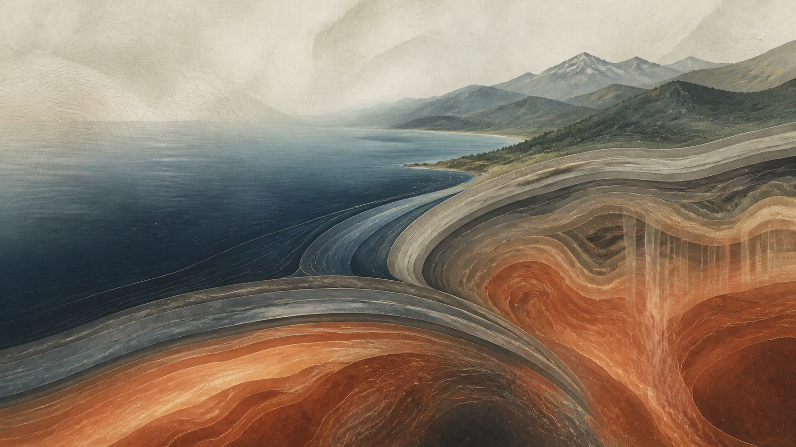

:::: {.hero-grid}
::: {.hero-copy}

Geodynamics · UT Austin

# From deep mantle flow to a moving surface

I am a PhD student in geosciences studying how subduction, lithospheric deformation, and mantle rheology shape dynamic topography and vertical crustal motion.

::: {.hero-actions}
[Explore my research](research.qmd){.btn .btn-primary .btn-lg}
[View my CV](cv.qmd){.btn .btn-outline-primary .btn-lg}
:::

Institute for Geophysics & Department of Earth and Planetary Sciences Jackson School of Geosciences · The University of Texas at Austin

:::

::: {.hero-visual}

Conceptual illustration, not a model result.

:::
::::

:::: {.home-section}
::: {.section-heading}

Research direction

## Connecting the deep Earth to observable motion

My work uses computational models, informed by geological, geophysical, and geochemical observations, to investigate large-scale geodynamic evolution.
:::

::: {.focus-grid}
::: {.focus-card}
01

### Cascadia & subduction

Investigating how subduction-system dynamics and the surrounding mantle relate to deformation and vertical motion.
:::

::: {.focus-card}
02

### Mantle rheology

Exploring how the mechanical behavior and flow of the mantle influence long-wavelength surface signals.
:::

::: {.focus-card}
03

### Dynamic topography

Studying links between deep mantle flow, lithospheric response, topography, and vertical crustal motion.
:::
:::

[See research themes and methods →](research.qmd)

::::

:::: {.home-section .home-section-alt}
::: {.section-heading}

Current work

## Global mantle-flow modeling

At UT Austin, advised by Prof. Thorsten Becker, I am setting up global mantle-flow models to investigate the deep mantle's contribution to surface vertical signals.
:::

::: {.fact-grid}
::: {.fact-item}
Approach

Computational geodynamics
:::

::: {.fact-item}
Languages

C · MATLAB · Fortran · Python
:::

::: {.fact-item}
Software

CitcomS · GMT6 · ASPECT · GPlates
:::
:::
::::
